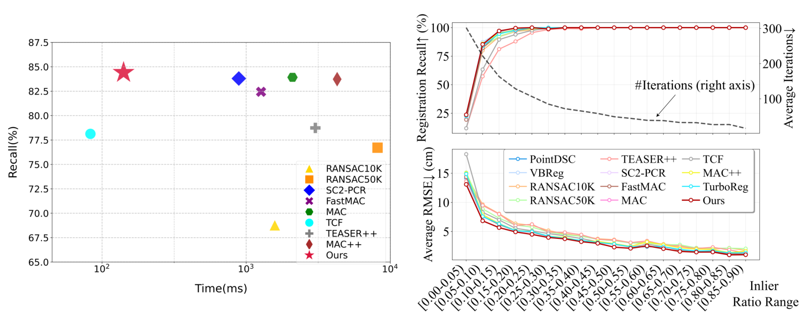
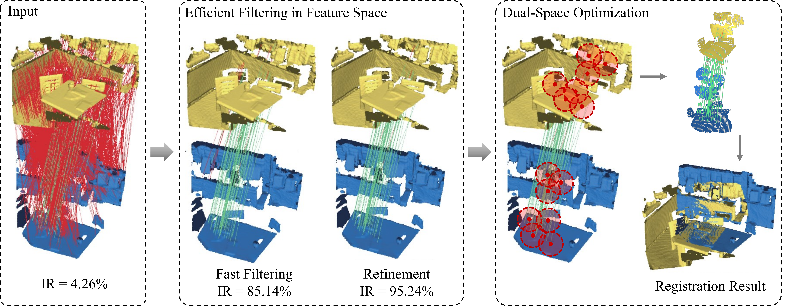

<br />

<p align="center">
    <h1 align="center">
        DualReg: Dual-Space Filtering and Reinforcement for Rigid Registration
    </h1>
  <p align="center">
  CVPR 2026
    <br />
    <a><strong>Jiayi Li</strong></a>
    ·
    <a href="https://yaoyx689.github.io/"><strong>Yuxin Yao*</strong></a>
    ·
    <a><strong>Qiuhang Lu</strong></a>
    ·
    <a href="http://staff.ustc.edu.cn/~juyong/"><strong>Juyong Zhang*</strong></a>
  </p>


  <p align="center">
    <a href='https://ustc3dv.github.io/DualReg/' style='padding-left: 0.5rem;'>
      </a>
  </p>
</p>
<br />

This repository contains the C++ implementation for the paper [DualReg: Dual-Space Filtering and Reinforcement for Rigid Registration](https://arxiv.org/abs/2508.17034), CVPR 2026.<br>
<p align="center">
  
</p>
 As shown above, DualReg achieves exceptional synergy between registration accuracy and computational efficiency. 

## Pipeline

<p align="center">
  
</p>

This paper presents an efficient and robust framework for rigid point cloud registration, whose overall pipeline is illustrated above. Our framework consists of three core sequential steps:
1. **Feature Correspondence Filtering**: We propose an efficient filtering algorithm for feature-based correspondences. It integrates a one-point RANSAC paradigm (rapidly filtering inaccurate matches via confidence scores) and a three-point RANSAC refinement module (boosting accuracy with probability-based weighted sampling) to obtain reliable anchor correspondences.
2. **Geometric Proxy Construction**: Taking the filtered anchors as priors, we construct geometric proxies to extract local geometry-based candidate correspondences with enhanced spatial consistency.
3. **Dual-space Optimization**: We design a dual-space optimization algorithm with adaptive robust weights, combined with an efficient iterative optimizer, to estimate the rigid transformation accurately and efficiently.

Extensive experimental results validate the registration accuracy and computational efficiency of our method.

## Dependencies and Installation

### 1. Clone the repository
```shell
git clone https://github.com/USTC3DV/DualReg.git
cd DualReg
```

### 2. Install PCL（PCL >= 1.8）
First install all necessary dependencies:
```shell
sudo apt-get update
sudo apt-get install git build-essential linux-libc-dev -y
sudo apt-get install cmake -y
sudo apt-get install libusb-1.0-0-dev libusb-dev libudev-dev -y
sudo apt-get install mpi-default-dev openmpi-bin openmpi-common -y
sudo apt-get install libflann1.9 libflann-dev -y
sudo apt-get install libeigen3-dev -y
sudo apt-get install libboost-all-dev -y
sudo apt-get install libvtk7.1p-qt libvtk7.1p libvtk7-qt-dev -y
sudo apt-get install libqhull* libgtest-dev -y
sudo apt-get install freeglut3-dev pkg-config -y
sudo apt-get install libxmu-dev libxi-dev -y
sudo apt-get install mono-complete -y
sudo apt-get install openjdk-8-jdk openjdk-8-jre -y
```
Then follow the **[official PCL compilation guide](https://pcl.readthedocs.io/projects/tutorials/en/latest/compiling_pcl_posix.html)** to build and install PCL from source.

### 3.Build DualReg
```shell
$ cd path-to-root-dir-of-DualReg
$ mkdir Release
$ cd Release
$ cmake -DCMAKE_BUILD_TYPE=Release ..
$ make
```


## Dataset
We evaluate our method on the **3DMatch**, **3DLoMatch**, and **KITTI** datasets.  
The original data (point clouds, ground‑truth and initial correspondences) can be obtained by following the instructions in the [dataset section of MAC](https://github.com/zhangxy0517/3D-Registration-with-Maximal-Cliques).

For these datasets we provide **additional normal information** for the correspondences, which is required by our method. The augmented correspondence files can be downloaded from [this link](https://pan.baidu.com/s/1TqorurFuSJTgMEf5WRVu9g?pwd=1229), password: 1229.  
Before running the code, please merge the downloaded normal‑augmented correspondences into the original dataset folders while keeping the same directory structure and naming convention.


## Quick start

```shell
# Run on 3DMatch with FPFH descriptors
./DualReg --output_path ./results/3dmatch_fpfh \
          --input_path /path/to/Processed_3dmatch_3dlomatch \
          --dataset_name 3dmatch \
          --descriptor fpfh \
          --start_index 0

# Run on 3DMatch with FCGF descriptors
./DualReg --output_path ./results/3dmatch_fcgf \
          --input_path /path/to/Processed_3dmatch_3dlomatch \
          --dataset_name 3dmatch \
          --descriptor fcgf \
          --start_index 0

# Run on 3DLoMatch with FPFH features
./DualReg --output_path ./results/3dlomatch_fpfh \
          --input_path /path/to/Processed_3dmatch_3dlomatch \
          --dataset_name 3dlomatch \
          --descriptor fpfh \
          --start_index 0

# Run on 3DLoMatch with FCGF features
./DualReg --output_path ./results/3dlomatch_fcgf \
          --input_path /path/to/Processed_3dmatch_3dlomatch \
          --dataset_name 3dlomatch \
          --descriptor fcgf \
          --start_index 0

# Run on KITTI with FPFH features
./DualReg --output_path ./results/kitti_fpfh \
          --input_path /path/to/Processed_KITTI/correspondence_fpfh \
          --dataset_name KITTI \
          --descriptor fpfh \
          --start_index 0

# Run on KITTI with FCGF features
./DualReg --output_path ./results/kitti_fcgf \
          --input_path /path/to/Processed_KITTI/correspondence_fcgf \
          --dataset_name KITTI \
          --descriptor fcgf \
          --start_index 0
```

Additional options:
- `--no_logs` : suppress per‑pair folder creation and logging.
- `--start_index <N>` : start processing from scene index N (0‑based). Useful for parallel execution on multiple scenes.

Results are saved as per‑pair `.txt` transforms, scene‑wise `.csv` summaries, and an overall `details.txt` file.


## Citation
If you find our code or paper useful, please consider citing:
```
@inproceedings{li2026dualreg,
  author    = {Li, Jiayi and Yao, Yuxin and Lu, Qiuhang and Zhang, Juyong},
  title     = {DualReg: Dual-Space Filtering and Reinforcement for Rigid Registration},
  booktitle = {The IEEE/CVF Conference on Computer Vision and Pattern Recognition},
  year      = {2026},
}
```

## Contact
For more questions, please contact SA23001023@mail.ustc.edu.cn

## Acknowledgement

This framework has been adapted from [MAC](https://github.com/zhangxy0517/3D-Registration-with-Maximal-Cliques), and some of the implementary refer to [TCF](https://github.com/ShiPC-AI/TCF). Thanks for their excellent work.
```
@inproceedings{zhang20233d,
  title={3D Registration with Maximal Cliques},
  author={Zhang, Xiyu and Yang, Jiaqi and Zhang, Shikun and Zhang, Yanning},
  booktitle={Proceedings of the IEEE/CVF Conference on Computer Vision and Pattern Recognition},
  pages={17745--17754},
  year={2023}
}
```
```
@ARTICLE{10758239,
  author={Shi, Pengcheng and Yan, Shaocheng and Xiao, Yilin and Liu, Xinyi and Zhang, Yongjun and Li, Jiayuan},
  journal={IEEE Robotics and Automation Letters}, 
  title={RANSAC Back to SOTA: A Two-Stage Consensus Filtering for Real-Time 3D Registration}, 
  year={2024},
  volume={9},
  number={12},
  pages={11881-11888},
  doi={10.1109/LRA.2024.3502056}}
```

